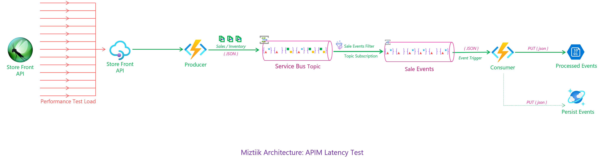
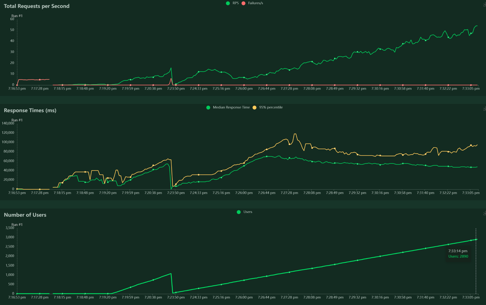
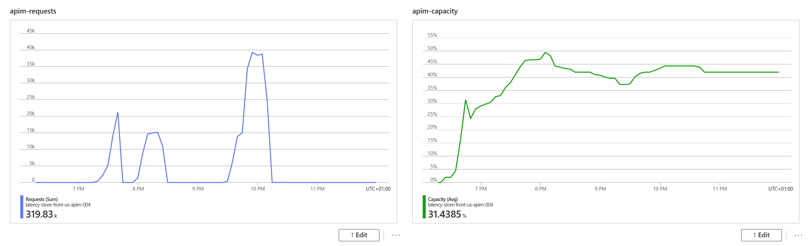
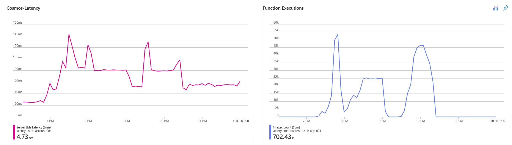
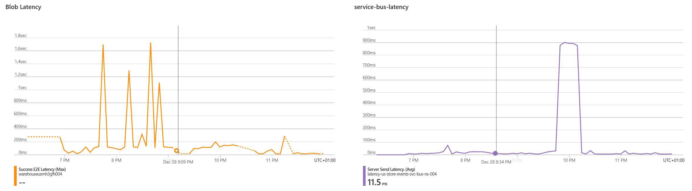
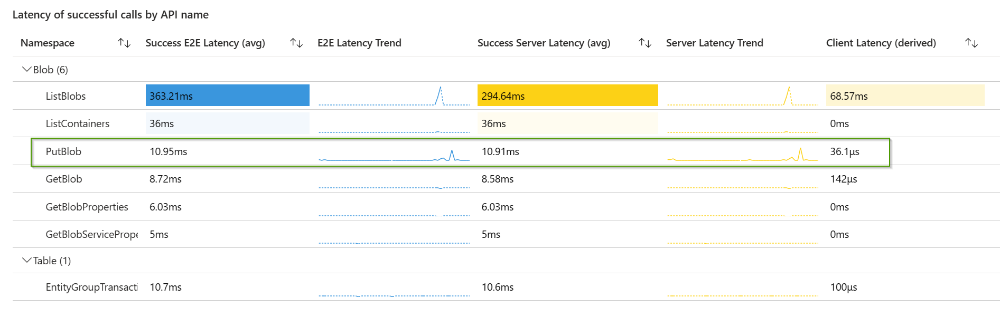
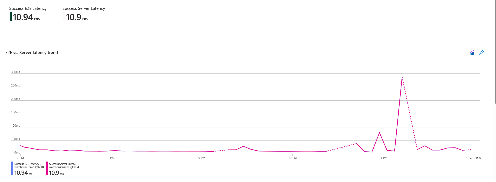
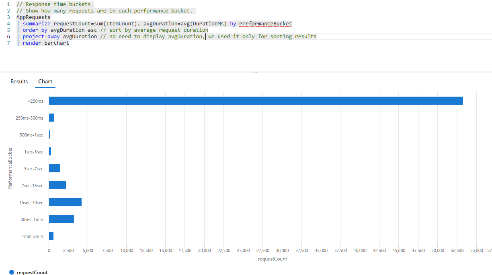
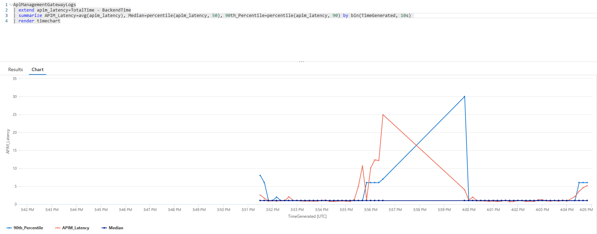
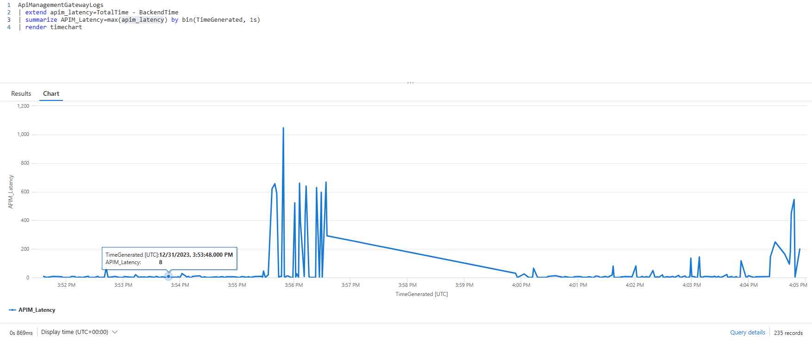

# Azure API Management Performance Latency Tests

A quick summary of throwing lot of traffic to Azure API Management and see how it performs. 

We will use the below architecture. 


- **Load Generation**: Locust will be used to generate the traffic at a rate of 1000 requests per second at peak. The load will be generated from a single host. The load will be generated for 40 minutes. 

- **Producer** - The request will be sent to the Azure API Management. The API Management will forward the request to the Azure Function App. The Azure Function App(Producer) will generate a store event and save it to a Service Bus Queue and returns response to APIM. 

- **Producer** - The consumer is triggered when a message is available in the Service Bus Queue. The Azure Function App(Consumer) will read the message from the queue and process it. The processed message is saved to a CosmosDB and Blob Storage..

# Create the Resources.

The bicep template will create the following resources: Azure Function App, API Management, Backend Service and the APIM Policy for configuring the backend. We have not configured the APIM to use the client certificate yet.

```bash
make all
```

## 🎯 Test the solution

Install Locust
```bash
pip install locust
```
The locust file to drive the load test can be found under `/locust/locust_script.py`. 

```bash
# Set variables with desired values
username="miztiik"
soft_limit=10000
hard_limit=200000

ulimit -n

# Check if the limits.conf file already contains the entries
if grep -q "^$username" /etc/security/limits.conf; then
    # If the entries exist, update the values
    sudo sed -i "/^$username/ s/\(soft\|hard\) nofile [0-9]*/\1 nofile $soft_limit/" /etc/security/limits.conf
else
    # If the entries don't exist, add them to the end of the file
    echo -e "\n$username soft nofile $soft_limit\n$username hard nofile $hard_limit" | sudo tee -a /etc/security/limits.conf
fi

ulimit -n 20000


cd /home/miztiik

# Run the locust file
TARGET_HOST=https://latency-store-front-us-apim-006.azure-api.net/api/
locust -f locust_script.py --host=${TARGET_HOST} -u 10000 -r 10 -t 40m --logfile /var/log/miztiik-locust.log --csv-full-history --csv=latency_store_front_us_apim
```

If you had configure port `8089` you can check the progress of the test by opening the browser and navigating to `http://<locust_host>:8089`. You can also download the `csv` file and plot the graph using excel or any other tool of your choice.



### 🧪 Analyze the results
The latency introduced by APIM is very minimal. The latency is less than 10ms. The latency is consistent throughout the test. Even at peak load, the blob put latency is less than 1ms.





[Azure Monitoring Community Github - Azure API Management Performance Latency Tests](https://github.com/microsoft/AzureMonitorCommunity) has lot of useful [queries](https://github.com/microsoft/AzureMonitorCommunity/tree/3c499be784e7ee0aab31f2fdbd6faed53ecb2614/Azure%20Services/API%20Management%20services) to analyze the results.




 


1. ## 🧹 CleanUp

   If you want to destroy all the resources created by the stack, Execute the below command to delete the stack, or _you can delete the stack from console as well_

   - Resources created during [Deploying The Solution](#-deploying-the-solution)
   - _Any other custom resources, you have created for this demo_

   ```bash
   # Delete from resource group
   az group delete --name Miztiik_Enterprises_xxx --yes
   # Follow any on-screen prompt
   ```

   This is not an exhaustive list, please carry out other necessary steps as maybe applicable to your needs.

## 📌 Who is using this

This repository aims to show how to Bicep to new developers, Solution Architects & Ops Engineers in Azure.

### 💡 Help/Suggestions or 🐛 Bugs

Thank you for your interest in contributing to our project. Whether it is a bug report, new feature, correction, or additional documentation or solutions, we greatly value feedback and contributions from our community. [Start here](/issues)

### 👋 Buy me a coffee

[](https://ko-fi.com/Q5Q41QDGK) Buy me a [coffee ☕][900].

### 📚 References

1. [Azure Docs - Validate client certificate in APIM][1]
1. [Azure Docs - Secure APIs using client certificate authentication in APIM][2]
1. [Azure Docs - Add a custom CA certificate in Azure APIM][3]
1. [Azure Docs - Secure backend services using client certificate authentication in APIM][4]
1. [Azure Docs - Using Certificates in Azure APIM][5]


[1]: https://learn.microsoft.com/en-us/azure/api-management/validate-client-certificate-policy
[2]: https://learn.microsoft.com/en-us/azure/api-management/api-management-howto-mutual-certificates-for-clients
[3]: https://learn.microsoft.com/en-us/azure/api-management/api-management-howto-ca-certificates
[4]: https://docs.microsoft.com/en-us/azure/api-management/api-management-howto-mutual-certificates-for-clients
[5]: https://techcommunity.microsoft.com/t5/fasttrack-for-azure/using-certificates-in-azure-api-management/ba-p/2888447


### 🏷️ Metadata


**Level**: 300

[100]: https://www.udemy.com/course/aws-cloud-security/?referralCode=B7F1B6C78B45ADAF77A9
[101]: https://www.udemy.com/course/aws-cloud-security-proactive-way/?referralCode=71DC542AD4481309A441
[102]: https://www.udemy.com/course/aws-cloud-development-kit-from-beginner-to-professional/?referralCode=E15D7FB64E417C547579
[103]: https://www.udemy.com/course/aws-cloudformation-basics?referralCode=93AD3B1530BC871093D6
[899]: https://www.udemy.com/user/n-kumar/
[900]: https://ko-fi.com/miztiik
[901]: https://ko-fi.com/Q5Q41QDGK